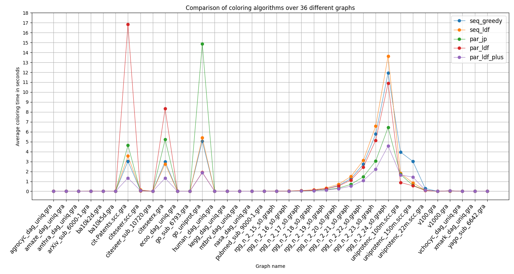
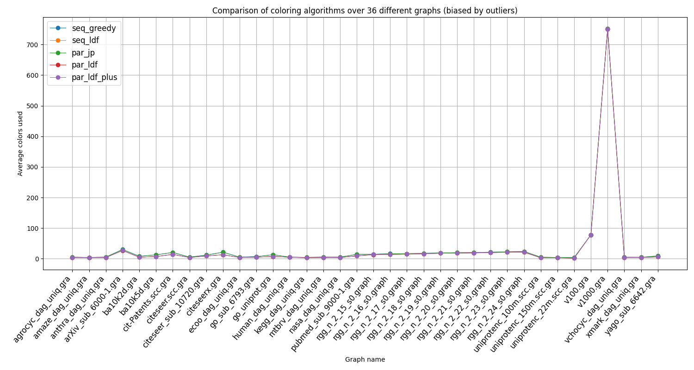
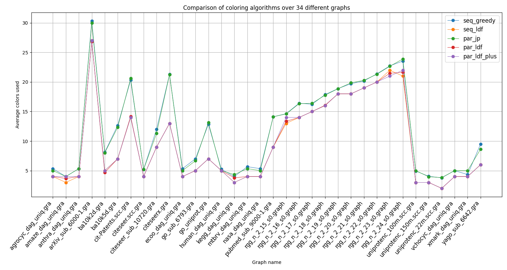
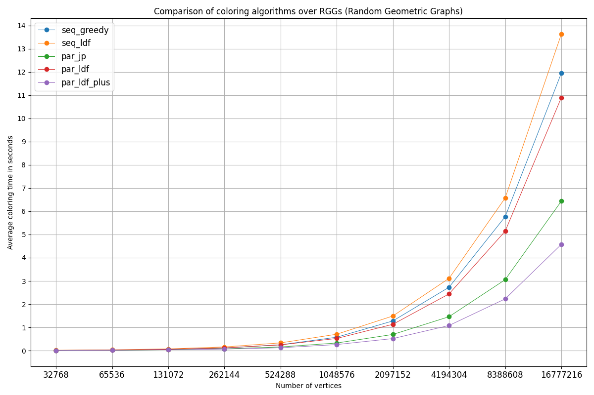
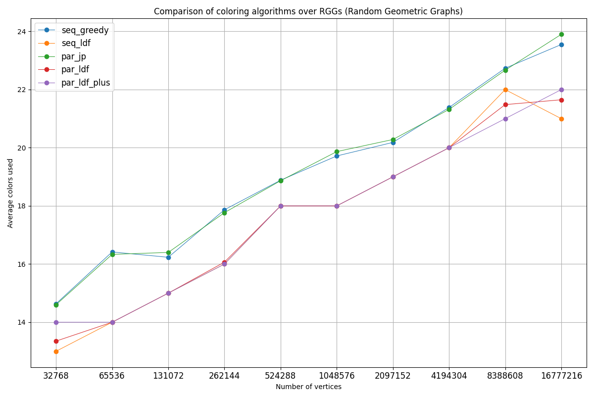
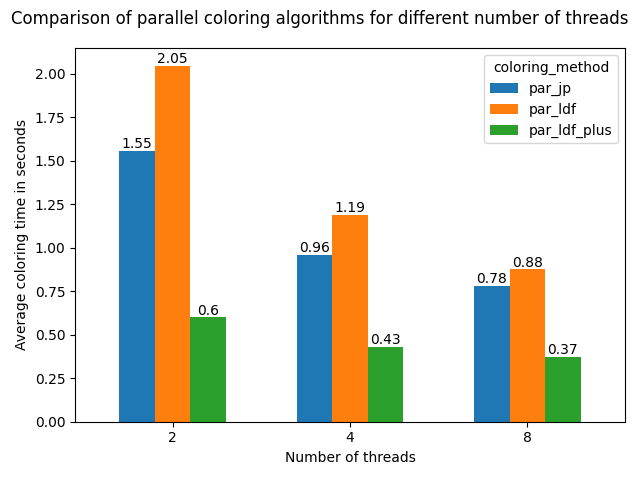

# Project documentation - Parallel Graph Coloring

**Authors:** Bonaccorsi Damiano, Santangelo Alessio

**Date:** 04 July 2021

**Version:** 1.2

## Table of Contents

- [Project documentation - Parallel Graph Coloring](#project-documentation---parallel-graph-coloring)
  - [Table of Contents](#table-of-contents)
  - [Introduction](#introduction)
  - [Graph representation](#graph-representation)
  - [Graph loading](#graph-loading)
    - [METIS (.graph extension)](#metis-graph-extension)
    - [Other (.gra extension)](#other-gra-extension)
  - [Chosen coloring algorithms](#chosen-coloring-algorithms)
    - [Sequential greedy](#sequential-greedy)
    - [Sequential Largest Degree First](#sequential-largest-degree-first)
    - [Parallel Jones-Plassmann](#parallel-jones-plassmann)
    - [Parallel Largest Degree First](#parallel-largest-degree-first)
    - [Parallel Largest Degree First "plus"](#parallel-largest-degree-first-plus)
  - [Experimental results](#experimental-results)
    - [Average coloring times by coloring method (all graphs)](#average-coloring-times-by-coloring-method-all-graphs)
    - [Average colors used by coloring method (all graphs)](#average-colors-used-by-coloring-method-all-graphs)
    - [Average colors used by coloring method (without outliers)](#average-colors-used-by-coloring-method-without-outliers)
    - [Average coloring times and colors used by coloring method (RGGs only)](#average-coloring-times-and-colors-used-by-coloring-method-rggs-only)
    - [Average coloring times by number of threads](#average-coloring-times-by-number-of-threads)
  - [Conclusions](#conclusions)

## Introduction

This document points out all the resources used, the design choices adopted and experimental evaluations obtained during the development of the project.

The first step involved learning what the problem of *Graph Coloring* is, and how the various coloring algorithms work. The problem of Graph Coloring consists in assigning labels (usually referred to as "colors") to each vertex of a graph, such that two adjacent vertices do not have the same color.

After looking up for some general information about the topic, we based most of our work on an article by *J. R. Allwright, R. Bordawekar, P. Coddington, K. Dinçer, Christine Martin, “A Comparison of Parallel Graph Coloring Algorithms” (1995)*, in order to have a more technical understanding of how sequential and parallel graph coloring algorithms can be implemented, and compare the results obtained by us with the results obtained in the article.

## Graph representation

To represent the graph internally, we decided to adopt the **adjacency list** representation. This representation is optimal for this kind of problem since all coloring algorithms require that, given a vertex, a list of the vertex's neighbours is known.

We further modified the representation to better adapt it to the coloring problem. For instance, every graph is considered to be unweighted and undirected, since these notions are not needed for the sake of coloring.

To each graph is also associated an array of colors, where *color[i]* is the color of vertex *i*, and an array of degrees, where *degree[i]* is the degree of vertex i. These arrays allow to retrieve both the color and the degree of a vertex in *O(1)* time, independently of the currently considered vertex.

## Graph loading

The developed program is capable of loading graphs from files with two different extensions.

### METIS (.graph extension)

When loading graphs from files using the *METIS* format, the program is capable of correctly reading all of the 4 official formats.

For instance, the program can load:

- Unweighted graphs *(2 or 3 parameters on the first line, with third parameter = 0)*
- Graphs with weights associated to edges *(3 parameters on the first line, with third parameter = 1)*
- Graphs with weights associated to vertices *(4 parameters on the first line, with third parameter = 10)*
- Graphs with weights associated to both edges and vertices *(3 parameters on the first line, with third parameter = 11)*

The program also supports the METIS extension where the third parameter on the first line equals to 100.
In general, self loops are simply ignored, and multiple edges are not an issue for the sake of coloring.

As mentioned before, the chosen internal representation does **NOT** take into account weights on either edges or vertices, so these fields are ignored.

### Other (.gra extension)

When loading graphs from files using this format, the loading works similarly to the *METIS* extension (i.e. iterate over lines and insert edge after edge).

The major difference is that these graphs are usually directed, so an edge from vertex i to vertex j is only reported on i's adjacency list, but our internal representation requires that both vertices share the information of an edge's existence. To solve this issue, each edge is inserted both from i to j, and from j to i.

## Chosen coloring algorithms

We have chosen to implement 3 different coloring algorithms, a simple sequential *greedy* algorithm, a parallel *Jones-Plassmann* algorithm, and finally a *Largest Degree First* algorithm (in its sequential version and two parallel versions), for a total of 5 coloring methods used at runtime.

The characteristics of each method are presented below.

### Sequential greedy

The sequential *greedy* algorithm accesses all vertices in random order and assigns a color to each of them, depending on the neighbours' colors. In particular, each vertex is colored with the smallest missing color from its neighbourhood, until all vertices are colored.

In our implementation, the vertices' access order is randomized at each run, resulting in a non-deterministic coloring.

As expected, the greedy algorithm is fast on small graphs, but on larger graphs it is easily outperformed by other algoritms both in terms of coloring time and number of colors used.

### Sequential Largest Degree First

The sequential *LDF* algorithm accesses all vertices starting from the ones with the largest degree and assigns a color to each of them in the same way as the greedy algorithm does.

In our implementation, the vertices are sorted using an heapsort based on their degrees.

As expected, the total coloring time is slightly higher than the greedy algorithm because we first need to sort the vertices using an *O(nlogn)* sort, while the greedy algorithm uses a *O(n)* randomizing function, but the number of colors used is consistently lower.

### Parallel Jones-Plassmann

The parallel *JP* algorithm is the first parallel algorithm we tried implementing.

The idea behind most parallel coloring algorithms that do **not** require synchronization, is that a *MIS (Maximum Independent Set)* of vertices can be colored at the same time at each iteration, and then "removed" from the graph (i.e. at the next iteration, colored vertices are only used to choose a color for the currently considered vertex, but are not considered for the sake of finding a MIS).

So the real problem lies in finding a MIS, and this is usually done by searching for vertices that are *local maxima* in the current subgraph (the graph resulting from the "removal" of the already-colored graph). This same approach is used by many different algorithm, and the major differences between each algorithm consist in **how** a vertex is to be considered a local maxima.

In the JP algorithm, a vertex is considered a local maxima if it has the largest *weight* in the neighbourhood, and conflicts are resolved by comparing the indexes of the conflicting vertices. The weight of each vertex is assigned randomly before the coloring phase.

In our implementation, the weights are assigned using the C function `rand()`, so they range from *0* to *RAND_MAX*. Then, a specified amount of threads is started. Each thread is idendified by an index i, which is also used to discern the groups of vertices that each thread will color (i.e. when using 8 threads, thread0 will color vertices 0,8,16,24.., thread1 will color vertices 1,9,17,25, etc..). In particular, every thread loops over its uncolored (color = 0) vertices and, for each of them, checks if that vertex is the one with the biggest weight among all of its uncolored neighbors; if so, the thread assigns the smallest missing color among the colored neighbors to the considered vertex.

This algorithm performs very well in most occasions, but given the randomic nature of the weights, it's not consistent and in particular graphs (like the `go_uniprot.gra` graph) it ends up taking even more time than the sequential algorithms. On average, it uses a number of colors comparable to the greedy algorithm.

We had also tried developing a "plus" version of this algorithm, where the vertices would be sorted by decreasing weight, so that accessing them in order could minimize the possibility of the current vertex not being a local maxima, but even if the new plus version seemed to be more consistent, it also had an higher average coloring time. We then decided to completely remove it, although a different implementation might have given better results.

### Parallel Largest Degree First

The *LDF* algorithm can be parallelized in a way very similar to the JP algorithm.

Instead of using random weights, a vertex is considered to be a local maxima if it has the highest degree in the neighbourhood.

More importantly, in our implementation, conflicts between vertices with the same degree are resolved by comparing their indexes. This is different than the solution proposed in the original article, but it allows for one smart optimization to be done in the "plus" version.

The coloring proceeds as per the JP algorithm. After starting a specified amount of threads, each thread will color its part of the subgraph. Again, the only difference lies in the fact that, for each vertex, the thread checks if that vertex is the one with the largest degree among all of its uncolored neighbors; if so, the thread assigns the smallest missing color among the colored neighbors to the considered vertex.

Time-wise, this first version of the algorithm performs really bad when compared to the JP algorithm, and the simple reason is that, although vertices are **colored** in descending degree order, they are still being **accessed** in a randomic fashion. And so, being the domain of degrees [0, max_degree] usually a lot smaller than the domain of JP's random weights [0, RAND_MAX), there are many more conflicts, and so vertices are more easily skipped and more time is needed to find a MIS.

### Parallel Largest Degree First "plus"

The parallel *LDF* plus algorithm is an optimization thought by us, similar to the one originally thought for the parallel JP plus algorithm.

The idea is that we can improve the performance of the original parallel LDF algorithm by sorting the vertices based on their degree, so that we can later access them in descending degree order, minimizing the risk of conflicts.

More importantly, in our implementation we sort the vertices using the C library function `qsort()`, passing a comparator that compares degrees, and, in case of conflicts, the indexes of the conflicting vertices. Since the original degrees' array is passed to `qsort()` in vertices' indexes order, and the comparator does **not** allow for vertices with the same degree to be swapped in respect to each-other, the resulting sort is effectively **stable**, which means the resulting array of vertices is sorted by degree **and** by vertex's index.

Coincidentally, this is the order at which vertices are meant to be colored.

What is left now is to color the vertices as fast as possible, to do so, we start a specified number of threads, and each thread will color its part of the subgraph.

In this implementation though, there is a bit of synchronization needed. Since the coloring phase has been adapted to run only **one** time for each thread, we need to make sure that a thread does not color a vertex that isn't a local maxima. This can only happen when a thread is currently trying to color a vertex that has an uncolored neighbour with higher degree, meant to be colored by *another* thread. Our solution was to have the thread wait until the neighbour is colored by the other thread.

The waiting is done by busy wait. The reason for using busy wait instead of any synchronization primitive is that threads are constantly running at nearly full speed, and being the vertices ordered by degree, it's fairly easy for threads to "catch-up" one another. So we avoid introducing synchronization overhead that could substantially increase coloring time.

This algorithm has proved to be the best overall coloring algorithm by consistently outperforming the other algorithms when the graphs' size increases, while maintaining the number of colors used as low as possible (nb. this particular implementation is **deterministic**, as such, given a graph it will always produce the same coloring as long as vertices' degrees and/or indexes don't change).

## Experimental results

All the proposed algorithms have been extensively tested, and the results have then been evaluated using *Python* to produce useful charts.

In total, we used 36 different graphs. For each graph, all the 5 coloring methods have been used 20 times each, with respectively 2, 4 and 8 threads for parallel algorithms, for a grand total of 10800 colorings produced (300 colorings/graph).

### Average coloring times by coloring method (all graphs)

As can be seen by the chart above, and as previously mentioned, the parallel LDF plus (purple line) consistently performed better than the other algorithms, with very few exceptions.

It's also possible to notice that some algorithms, like the parallel JP (green line), suffered particularly with some graphs, while others didn't.

A tabular view of the data is reported below
graph_name|par_jp|par_ldf|par_ldf_plus|seq_greedy|seq_ldf
---|---|---|---|---|---
agrocyc_dag_uniq.gra|0.00269|0.00129|0.00135|0.00101|0.00098
amaze_dag_uniq.gra|0.00191|0.00106|0.00082|0.0004|0.00077
anthra_dag_uniq.gra|0.00229|0.00126|0.00195|0.00097|0.00092
arXiv_sub_6000-1.gra|0.00711|0.01192|0.0032|0.00345|0.00428
ba10k2d.gra|0.00207|0.00201|0.00254|0.00154|0.00224
ba10k5d.gra|0.00513|0.00779|0.00261|0.00305|0.00403
cit-Patents.scc.gra|4.64181|16.83035|1.34418|3.03604|3.55682
citeseer.scc.gra|0.0452|0.03802|0.07629|0.10753|0.14229
citeseer_sub_10720.gra|0.0042|0.0046|0.00343|0.00264|0.00416
citeseerx.gra|5.22206|8.32403|1.32292|2.99805|2.76169
ecoo_dag_uniq.gra|0.00299|0.00118|0.0016|0.00095|0.0009
go_sub_6793.gra|0.00342|0.00149|0.00185|0.00099|0.00186
go_uniprot.gra|14.87172|1.91207|1.87685|5.05534|5.39531
human_dag_uniq.gra|0.00311|0.00263|0.00441|0.003|0.00226
kegg_dag_uniq.gra|0.00041|0.00206|0.00193|0.00031|0.0005
mtbrv_dag_uniq.gra|0.00206|0.00081|0.00122|0.00081|0.00082
nasa_dag_uniq.gra|0.00191|0.00092|0.00193|0.00055|0.00097
pubmed_sub_9000-1.gra|0.00629|0.00474|0.00242|0.00217|0.0032
rgg_n_2_15_s0.graph|0.00754|0.01101|0.00913|0.00954|0.0155
rgg_n_2_16_s0.graph|0.01567|0.02456|0.01748|0.02268|0.03438
rgg_n_2_17_s0.graph|0.03496|0.05421|0.03638|0.05014|0.07395
rgg_n_2_18_s0.graph|0.07468|0.11595|0.06533|0.11178|0.15731
rgg_n_2_19_s0.graph|0.15745|0.24567|0.12173|0.25022|0.33249
rgg_n_2_20_s0.graph|0.32673|0.52312|0.25973|0.57682|0.70548
rgg_n_2_21_s0.graph|0.69552|1.13281|0.51793|1.2778|1.49008
rgg_n_2_22_s0.graph|1.45942|2.44064|1.08099|2.72793|3.11112
rgg_n_2_23_s0.graph|3.05434|5.14179|2.22627|5.76778|6.5733
rgg_n_2_24_s0.graph|6.43578|10.89558|4.57433|11.94909|13.62735
uniprotenc_100m.scc.gra|1.70564|0.88829|1.64317|3.95725|1.79842
uniprotenc_150m.scc.gra|0.59583|0.5581|1.43326|3.01426|0.86186
uniprotenc_22m.scc.gra|0.11983|0.07308|0.13342|0.28555|0.10846
v100.gra|0.0024|0.00267|0.00332|0.00025|0.00024
v1000.gra|0.04785|0.05764|0.03686|0.03183|0.0301
vchocyc_dag_uniq.gra|0.00215|0.00188|0.00188|0.00075|0.00077
xmark_dag_uniq.gra|0.00254|0.0009|0.00085|0.00054|0.00089
yago_sub_6642.gra|0.00428|0.00211|0.0022|0.002|0.00258

### Average colors used by coloring method (all graphs)

The chart above isn't really meaningful because of the `v1000.gra` graph completely altering the y scale, but we decided to include it for completeness.

### Average colors used by coloring method (without outliers)

After removing the `v100.gra` and `v1000.gra` graphs from the plot, we can more easily take a look at how each different coloring method performs in terms of colors used.

As expected, the sequential LDF, the parallel LDF, and the parallel LDF plus (respectively yellow, red and purple lines), consistently used less colors than the sequential greedy and the parallel JP algorithms did.

### Average coloring times and colors used by coloring method (RGGs only)

The above charts are useful to grasp a general idea of how well each coloring method performs, but they are dispersive and they do not take into account the topological differences between graphs.

To easily compare the different coloring methods on a more "regular" set of graphs, the following charts are presented, where only the results obtained over RGGs (Random Geometric Graphs) are considered.

### Average coloring times by number of threads

Finally, we compared how much difference there is between the parallel coloring methods when using more threads.

The biggest improvement in coloring time is obtained when increasing from 2 to 4 threads. Overall it's safe to assume that an higher number of threads **does** indeed increase performance.

## Conclusions

In conclusion, most of our work focused on testifying how parallel coloring algorithms can lead to a substantial speed-up in coloring performance, especially when dealing with graphs having a high number of vertices.

We then compared each of the coloring algorithms, in terms of coloring speed and number of colors used, in order to establish which one is the most appropriate depending on the coloring needs.

As a result, in accordance to the original article, the Largest Degree First algorithm (in its "plus" implementation) deemed to be the most appropriate algorithm to use when coloring large graphs on systems that support multi-threading, as it maintains both lower coloring times and a lower number of colors used.

On smaller graphs on the other hand, its sequential version could be a valid alternative when a low number of colors used is necessary.

We would also like to suggest that a non-deterministic implementation of the parallel LDF plus can be easily obtained with very few changes. For example, by assigning a random unique index to each vertex instead of using the original one (for the sake of coloring only), so that the order in which vertices are colored is different at each run. The reason we did not implement this version is that it adds upon the plus version, resulting in a slower coloring, which is not of interest for this project.
